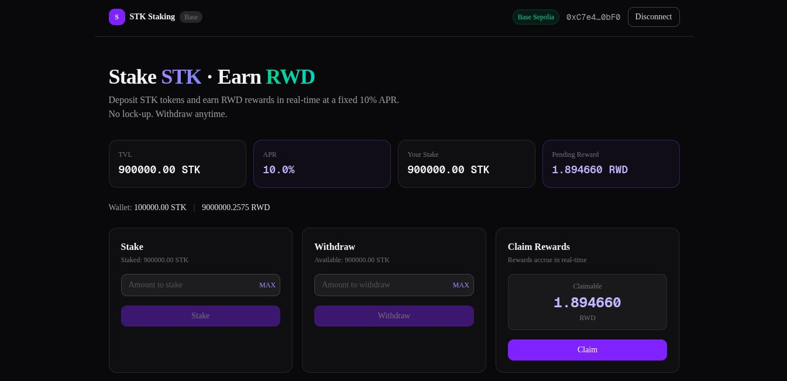

# STK Staking — DeFi Staking on Base

A full-stack DeFi staking application built on Base. Users stake **STK** tokens and earn **RWD** rewards at a fixed 10% APR, accrued in real-time with no lock-up period.

**Live Demo:** [staking-foundry-app.netlify.app](https://staking-foundry-app.netlify.app)



---

## Overview

| Layer | Stack |
|---|---|
| Smart Contracts | Solidity 0.8.24, Foundry |
| Network | Base Sepolia (testnet) |
| Frontend | Next.js 16, wagmi v3, viem v2 |
| Wallet | MetaMask (via injected connector) |
| RPC | Alchemy |
| Hosting | Netlify |

---

## Contracts (Base Sepolia)

| Contract | Address |
|---|---|
| StakeToken (STK) | [`0x70CfCA7e5a194Fbb7b2BF7Ab972a098351E95974`](https://sepolia.basescan.org/address/0x70cfca7e5a194fbb7b2bf7ab972a098351e95974) |
| RewardToken (RWD) | [`0x180fd1e169E2474869C94d98959B34036b7dca90`](https://sepolia.basescan.org/address/0x180fd1e169e2474869c94d98959b34036b7dca90) |
| Staking | [`0xD1c0e6f51d066422e03CC5510eE88144B3577c1c`](https://sepolia.basescan.org/address/0xd1c0e6f51d066422e03cc5510ee88144b3577c1c) |

All contracts are verified on Basescan.

---

## How It Works

### Reward Model

```
reward = stakedAmount × (block.timestamp − lastUpdate) × rewardRatePerSecond / 1e18
```

- Rate: `3_170_979_198` (scaled 1e18) → 10% APR
- Rewards accrue per second, per token staked
- No lock-up — withdraw anytime

### Core Functions

| Function | Description |
|---|---|
| `stake(uint256 amount)` | Deposit STK tokens |
| `withdraw(uint256 amount)` | Withdraw staked tokens |
| `claim()` | Claim accumulated RWD rewards |
| `pendingReward(address)` | View claimable reward |

### Security

- `ReentrancyGuard` on all state-changing functions
- `SafeERC20` for all token transfers
- `Ownable` access control for admin functions

---

## Project Structure

```
staking-foundry/
├── src/
│   ├── Staking.sol        # Main staking contract
│   ├── StakeToken.sol     # ERC20 stake token (STK)
│   └── RewardToken.sol    # ERC20 reward token (RWD)
├── test/
│   └── Staking.t.sol      # 10 Foundry tests
├── script/
│   └── Deploy.s.sol       # Deployment script
└── frontend/              # Next.js app
    ├── src/
    │   ├── app/staking/   # Staking page
    │   ├── components/    # UI components
    │   └── lib/           # wagmi config, contract ABIs
    └── netlify.toml
```

---

## Getting Started

### Prerequisites

- [Foundry](https://book.getfoundry.sh/getting-started/installation)
- Node.js 18+

### Smart Contracts

```bash
# Install dependencies
forge install

# Build
forge build

# Run tests
forge test -v

# Run tests with gas report
forge test --gas-report
```

**Test results:** 10/10 passing

```
test_ClaimReward                       ✓
test_MultipleUsers                     ✓
test_MultipleUsersIndependentRewards   ✓
test_RewardAccruesOverTime             ✓
test_RewardResetsAfterClaim            ✓
test_StakeSuccess                      ✓
test_StakeZeroReverts                  ✓
test_WithdrawMoreThanStakedReverts     ✓
test_WithdrawSuccess                   ✓
test_YearlyRewardApprox10Percent       ✓
```

### Deploy Contracts

```bash
cp .env.example .env
# Fill in PRIVATE_KEY, RPC_URL, BASESCAN_API_KEY

forge script script/Deploy.s.sol \
  --rpc-url $RPC_URL \
  --private-key $PRIVATE_KEY \
  --broadcast \
  --verify
```

### Frontend

```bash
cd frontend

cp .env.local.example .env.local
# Fill in contract addresses and RPC URL

npm install
npm run dev
```

Open [http://localhost:3000/staking](http://localhost:3000/staking)

---

## Environment Variables

**Contracts (`.env`)**

```env
PRIVATE_KEY=0x...
RPC_URL=https://base-sepolia.g.alchemy.com/v2/YOUR_KEY
BASE_MAINNET_RPC_URL=https://base-mainnet.g.alchemy.com/v2/YOUR_KEY
BASESCAN_API_KEY=YOUR_KEY
```

**Frontend (`frontend/.env.local`)**

```env
NEXT_PUBLIC_RPC_URL=https://base-sepolia.g.alchemy.com/v2/YOUR_KEY
NEXT_PUBLIC_STAKING_ADDRESS=0x...
NEXT_PUBLIC_STAKE_TOKEN_ADDRESS=0x...
NEXT_PUBLIC_REWARD_TOKEN_ADDRESS=0x...
```

---

## Frontend Features

- Connect wallet (MetaMask, any injected wallet)
- Auto network switch to Base Sepolia
- Stake STK with approve flow
- Withdraw anytime
- Claim RWD rewards
- Live reward counter (updates every second)
- APR display
- TVL (Total Value Locked)
- Wallet balance display

---

## License

MIT
